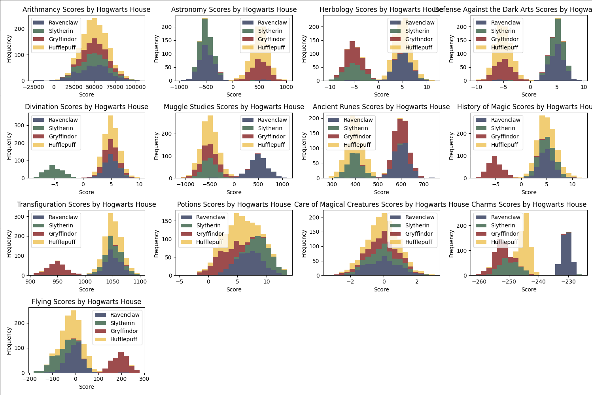

# Harry Potter Sorting hat

This project is part of the 42 network cursus (dslr). In this project, we will explore Machine Learning by discovering different tools and implementing a linear classification model, specifically a logistic regression. This project will guide you through the basics of data exploration, visualization, and preprocessing before feeding the data into the machine learning algorithm. The goal is to solve a classification problem using logistic regression.

## Project structure

```
.
|____data_analysis
|____data_preprocessing
| |____data_preprocessing.py
|____environment.yml
|____utils
| |____utils.py
|____scripts
| |____run_data_preprocessing.py
| |____run_data_analysis.py
| |____run_logistic_regression_prediction.py
| |____run_logistic_regression_training.py
| |____run_logistic_regression_evaluation.py
| |____run_data_visualization.py
|____README.md
|____data_visualization
| |____data_visualization.py
|____logistic_regression
| |____logistic_regression.py
|____data
| |____processed
| |____raw
| | |____datasets
| | | |____dataset_train.csv
| | | |____dataset_test.csv
| | |____datasets.tgz

```


## Aim of the Project

- Learn how to read a dataset and visualize it in different ways.
- Select and clean unnecessary information from your data.
- Train a logistic regression model to solve a classification problem.
- Create a machine learning toolkit for data exploration and model training.

## Data Visualization and Interpratation

### Homogenity of Course Scores Across Hogwarts Houses
One of the key steps in our data analysis was to determine the most homogenous distribution of scores across all four houses. To achieve this, we created histograms for each course, segmented by house. Below is a screenshot of the histograms generated:


#### Interpretation 

To identify the most homogenous distribution score, we considered the following factors across all four houses:
- **Shape Consistency**: The shape of the distribution is consistent across all houses.
- **Range and Spread**: The range and spread of scores are similar across houses.
- **Central Tendency**: The mean and median are similar across houses.
- **Overlapping Areas**: More overlap indicates more similarity in distributions.

After analyzing the plots, we observed that two courses, **Arithmancy** and **Care of Magical Creatures**, exhibit significant homogeneity. However, **Care of Magical Creatures** shows more homogeneity compared to **Arithmancy**. This is indicated by its narrow range, aligned peaks, and a high degree of overlap, suggesting that the score distributions are more similar across houses. In contrast, **Arithmancy** has a wider range and spread, along with some outliers, indicating less homogeneity.

By examining these visualizations, we gain valuable insights into the distribution of scores across different houses, which helps in better understanding the data and refining our approach for the classification problem.